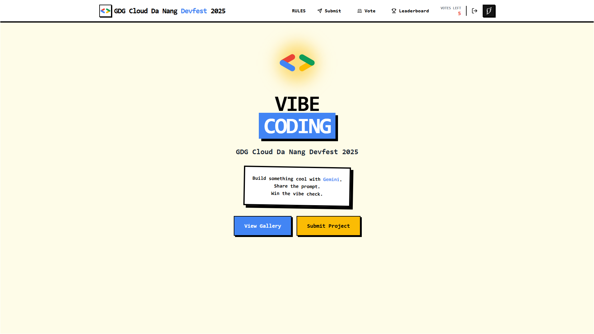
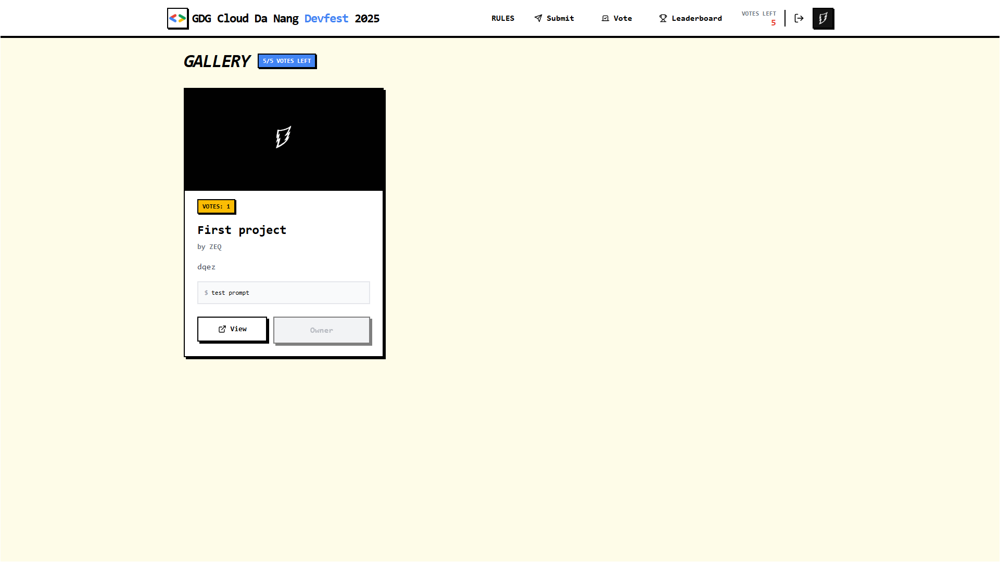
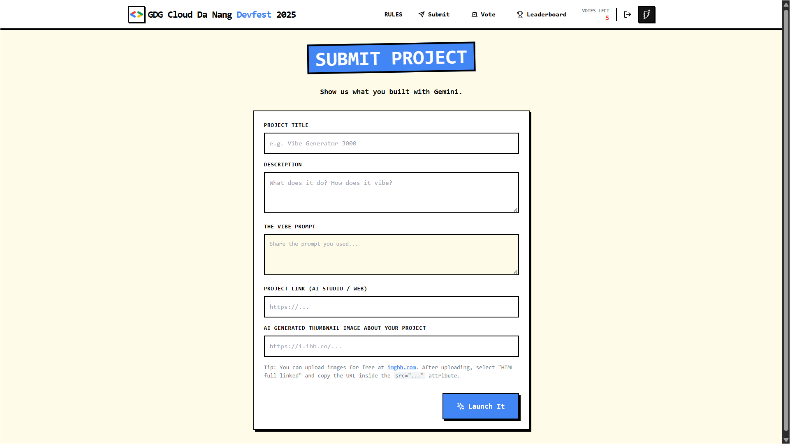
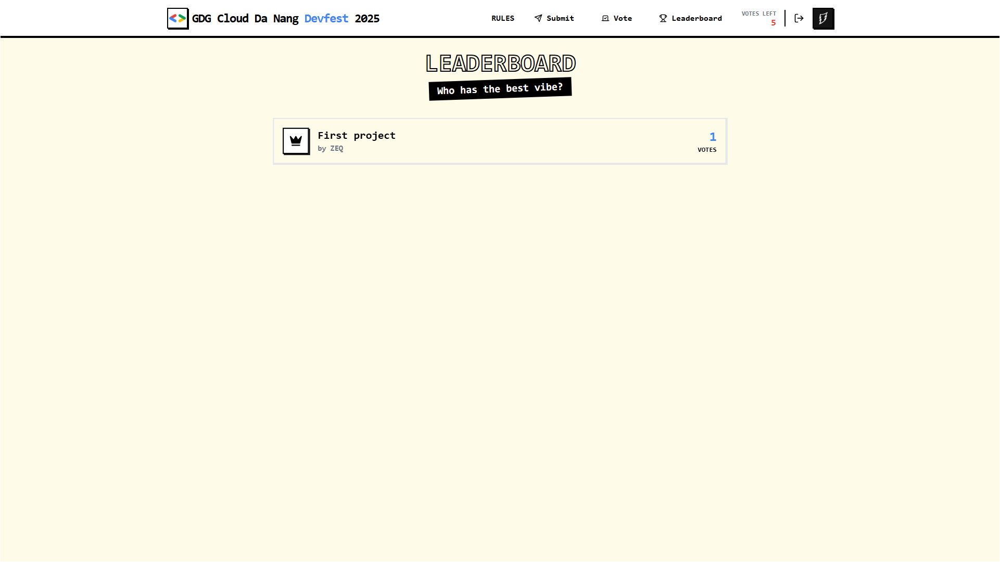

# VIBE CODING - GDG Cloud Da Nang Devfest 2025  


A voting platform for GDG Cloud Da Nang Devfest 2025 where developers showcase their Gemini AI projects and receive votes from the community.

<div align="center">
</div>

## Screenshots

<table>
  <tr>
    <td width="50%">
      <h3 align="center">Home Page</h3>
      
    </td>
    <td width="50%">
      <h3 align="center">Vote Gallery</h3>
      
    </td>
  </tr>
  <tr>
    <td width="50%">
      <h3 align="center">Submit Project</h3>
      
    </td>
    <td width="50%">
      <h3 align="center">Leaderboard</h3>
      
    </td>
  </tr>
</table>

## Key Features

### Authentication
- Google OAuth 2.0 login
- Automatic user profile and avatar storage

### Project Management
- Submit projects with title, description, Gemini prompt, and thumbnail
- Responsive card gallery layout
- Thumbnail preview support for each project

### Voting System
- 5 votes per user
- Cannot vote for own projects
- No duplicate votes on the same project
- Unvote option to reclaim votes

### Leaderboard
- Real-time ranking updates based on votes
- Special visual styling for top 3 projects
- Fully responsive design

### User Interface
- Neo-brutalism design with bold borders and shadows
- Official GDG brand colors
- Built with Tailwind CSS
- Smooth animations and transitions

## Tech Stack

### Backend
- ASP.NET Core 8.0
- Entity Framework Core
- SQL Server
- Google OAuth 2.0

### Frontend
- Razor Views
- Tailwind CSS
- Bootstrap 5
- JavaScript

### Database Schema
```
Users
├── Id (PK)
├── GoogleId
├── Email
├── Name
├── AvatarUrl
└── CreatedAt

Projects
├── Id (PK)
├── Title
├── Description
├── Prompt
├── ProjectLink
├── ThumbnailLink
├── UserId (FK)
└── CreatedAt

Votes
├── Id (PK)
├── UserId (FK)
├── ProjectId (FK)
└── VotedAt
```

## Project Structure

```
votegdgc/
├── Controllers/
│   ├── AccountController.cs      # Google OAuth login/logout
│   ├── HomeController.cs          # Index, Vote, Leaderboard
│   └── ProjectsController.cs      # Create, Vote, Unvote
├── Data/
│   └── AppDbContext.cs            # EF Core DbContext
├── Migrations/
│   └── ...                        # Database migrations
├── Models/
│   ├── User.cs                    # User entity
│   ├── Project.cs                 # Project entity
│   ├── Vote.cs                    # Vote entity
│   └── ErrorViewModel.cs
├── Views/
│   ├── Home/
│   │   ├── Index.cshtml           # Landing page
│   │   ├── Vote.cshtml            # Project gallery
│   │   └── Leaderboard.cshtml     # Rankings
│   ├── Projects/
│   │   └── Create.cshtml          # Submit form
│   └── Shared/
│       ├── _Layout.cshtml         # Main layout
│       └── Error.cshtml
├── wwwroot/
│   ├── assets/                    # Images & screenshots
│   ├── css/
│   │   ├── tailwind.css          # Tailwind styles
│   │   └── site.css              # Custom styles
│   └── js/
│       └── site.js
├── appsettings.json
├── Program.cs
└── votegdgc.csproj
```

## Usage

### For Participants

1. Login with your Google account
2. Submit your project with title, description, Gemini prompt, and thumbnail
3. Browse the gallery and vote for projects you like (5 votes maximum)
4. Unvote if you change your mind
5. Check the leaderboard to see rankings

### For Administrators

- Access database via SQL Server Management Studio or Azure Data Studio
- Monitor logs through console output
- Perform regular database backups

## Configuration

### Customize Votes Per User

Edit `Models/User.cs`:
```csharp
public int RemainingVotes => 5 - (Votes?.Count ?? 0); // Change 5 to your preferred limit
```

### Customize GDG Colors

Edit `wwwroot/css/tailwind.css`:
```css
--gdg-blue: #4285f4;
--gdg-red: #ea4335;
--gdg-yellow: #fbbc04;
--gdg-green: #34a853;
```

## Contributing

Contributions are welcome! Please feel free to submit a Pull Request.

1. Fork the project
2. Create your feature branch (`git checkout -b feature/AmazingFeature`)
3. Commit your changes (`git commit -m 'Add some AmazingFeature'`)
4. Push to the branch (`git push origin feature/AmazingFeature`)
5. Open a Pull Request

## License

This project was created for GDG Cloud Da Nang Devfest 2025.

## Credits

- GDG Cloud Da Nang community
- Google Developer Groups
- Tailwind CSS

---

Built for GDG Cloud Da Nang Devfest 2025
